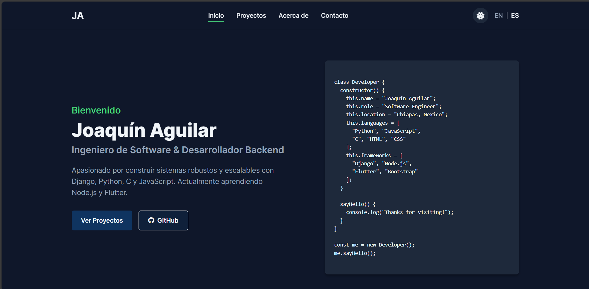

# Portfolio Web Personal - Joaquín Aguilar

Un portfolio web personal moderno y responsive desarrollado con Node.js, Express y EJS. Características incluyen cambio de idioma (inglés/español), modo oscuro/claro, y fondo interactivo con partículas.



## Características

- Diseño responsive para dispositivos de todos los tamaños
- Cambio entre modo oscuro y claro con detección de preferencias del sistema
- Cambio de idioma entre inglés y español
- Fondo interactivo con partículas
- Elementos animados en la página
- Sección de proyectos destacados
- Sección de habilidades y tecnologías
- Sección de certificaciones
- Sección de aprendizaje actual
- Interfaz moderna y atractiva

## Requisitos previos

- Node.js (v14.x o superior recomendado)
- npm (v6.x o superior)

## Instalación

1. Clona el repositorio:
```bash
git clone https://github.com/JoaquiinAguilar/portfolio-website.git
cd portfolio-website
```

2. Instala las dependencias:
```bash
npm install
```

3. Crea un archivo `.env` en el directorio raíz (opcional):
```
PORT=3000
```

## Ejecución

### Modo Desarrollo

Ejecuta la aplicación con nodemon para reinicios automáticos del servidor:

```bash
npm run dev
```

### Modo Producción

Ejecuta la aplicación en modo producción:

```bash
npm start
```

Visita `http://localhost:3000` en tu navegador para ver el sitio web.

### Modo Oscuro/Claro

Implementación de cambio entre modo oscuro y claro con detección automática de preferencias del sistema y persistencia mediante localStorage.

### Fondo Interactivo con Partículas

Fondo animado e interactivo creado con particles.js que responde a los movimientos del ratón.

### Diseño Responsive

El sitio web se adapta perfectamente a diferentes tamaños de pantalla, desde dispositivos móviles hasta escritorio.

## Personalización

- **Información Personal**: Actualiza tu información personal en los archivos EJS.
- **Proyectos**: Añade tus proyectos en el archivo `projects.ejs`.
- **Certificaciones**: Añade tus certificaciones en la sección correspondiente.
- **Colores del Tema**: Modifica el esquema de colores en el archivo `public/css/style.css`.
- **Efecto de Partículas**: Personaliza el efecto de partículas en `public/js/particles-config.js`.

## Tecnologías Utilizadas

- **Backend**: Node.js, Express
- **Frontend**: HTML5, CSS3, JavaScript, EJS
- **Librerías**: Font Awesome, Particles.js

## Desarrollo Futuro

Características planeadas para futuras actualizaciones:

- Panel de administración para gestionar contenido
- Blog integrado
- Portafolio expandido con galería de imágenes
- Integración con servicios de backend para el formulario de contacto

## Licencia

Este proyecto está licenciado bajo la Licencia MIT - ver el archivo LICENSE para más detalles.

## Contacto

Joaquín Aguilar - [joaquinaguilar492@outlook.com](mailto:joaquinaguilar492@outlook.com)

LinkedIn: [https://www.linkedin.com/in/joaquin-aguilar-ab3515216](https://www.linkedin.com/in/joaquin-aguilar-ab3515216)
